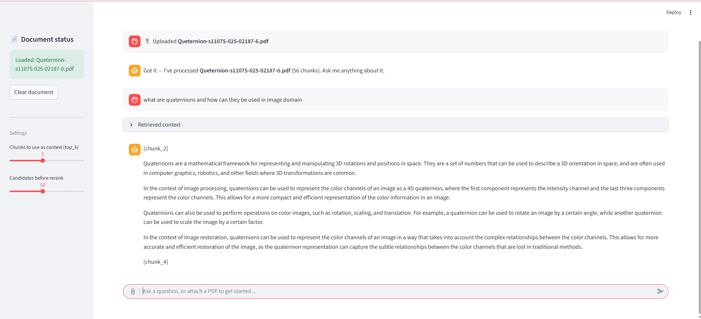

# 📚 RAG 

A local Retrieval-Augmented Generation (RAG) pipeline that lets you ask
questions about a PDF (e.g. a computer vision textbook) and get grounded,
citation-backed answers from a local LLM via [Ollama](https://ollama.com/).

The pipeline combines:
- **Dense retrieval** — embeddings via `BAAI/bge-small-en-v1.5`, stored in a local **ChromaDB** collection
- **Sparse retrieval** — keyword search via **BM25**
- **Reciprocal Rank Fusion (RRF)** — merges dense + sparse results
- **Cross-encoder reranking** — `cross-encoder/ms-marco-MiniLM-L-6-v2` re-sorts the fused candidates for higher precision
- **Local generation** — `llama3.2:3b` served through Ollama, no external API calls

---

## 🗂 Project structure

```
.
├── preprocesser.py   # PDF → chunks → embeddings → Chroma collection
├── retriever.py       # BM25 + dense search, RRF fusion, cross-encoder reranking
├── generator.py       # Calls the local Ollama model to generate an answer
├── rag.py             # Option 1: run as a script — batch of test queries in the terminal
├── stream.py          # Option 2: run as a Streamlit chat app
├── computer_vision.pdf   # (not included — add your own PDF)
└── README.md
```

---

## ⚙️ Setup

1. **Install [Ollama](https://ollama.com/download)** and pull the model used by `generator.py`:
   ```bash
   ollama pull llama3.2:3b
   ```
   Make sure the Ollama server is running (it usually starts automatically after install).

2. **Install Python dependencies:**
   ```bash
   pip install streamlit pypdf langchain-text-splitters chromadb sentence-transformers rank_bm25 ollama
   ```

3. **Add your PDF** to the project folder (default expected name: `computer_vision.pdf`, configurable in `rag.py` / `stream.py`).

---

## ▶️ Option 1 — Run in the terminal (`rag.py`)

A straightforward script that processes the PDF once, then runs a fixed batch
of 10 sample computer vision questions through the pipeline and prints both
a plain-LLM answer and a RAG-grounded answer for comparison.

```bash
python rag.py
```

What it does:
1. Chunks the PDF (`chunk_size=1500`, `chunk_overlap=300`) and embeds it into ChromaDB (cached — only rebuilt if the chunk count changes).
2. For each query: hybrid retrieval (dense + BM25) → RRF fusion → cross-encoder rerank → top 5 chunks.
3. Builds a context-grounded prompt and asks the local LLM to answer, citing chunk IDs.

Edit the `query_list` in `rag.py` to test your own questions.

---

## ▶️ Option 2 — Run as a chat app (`stream.py`)

A Streamlit chat interface where you attach a PDF directly in the chat box
(via the **+** icon) and then ask questions about it conversationally.

```bash
streamlit run stream.py
```

- Attach a PDF using the **+** icon in the chat input — it's processed automatically (chunked, embedded, cached).
- Ask questions in the same chat box; answers are generated using the retrieved context, with citations to chunk IDs.
- Expand **"Retrieved context"** under any answer to inspect exactly which chunks were used.
- Use the sidebar sliders to tune `top_k` (how many chunks are used as context) and `candidate_k` (how many candidates are considered before reranking).
- Click **"Clear document"** in the sidebar to reset and load a different PDF.

**Example:**



*(Place a screenshot of the running app named `a.png` in the repo root — GitHub will render it inline above.)*

---

## 🧠 How retrieval works

```
user query
   ├─→ dense search (embeddings, whole corpus)   ─┐
   └─→ BM25 search (keywords, whole corpus)       ─┼→ RRF fusion → top N candidates
                                                     ↓
                                    cross-encoder reranker (query + chunk together)
                                                     ↓
                                          re-sorted top-k chunks → passed to the LLM
```

Dense embeddings and BM25 catch different things — embeddings are strong on
semantic/paraphrased matches, BM25 is strong on exact keywords, codes, and
rare terms. Fusing both, then reranking the shortlist with a cross-encoder
that sees the query and chunk together, gives a more accurate final context
than either method alone.

---
